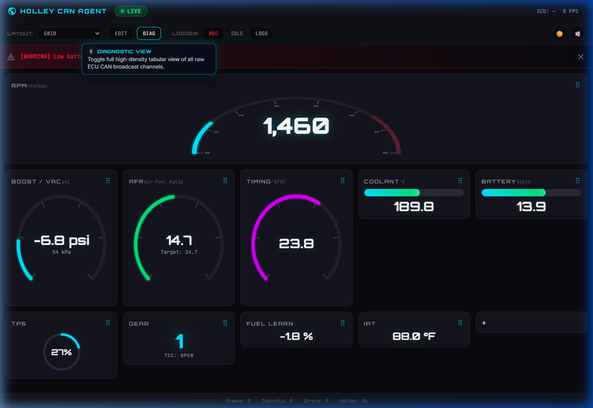
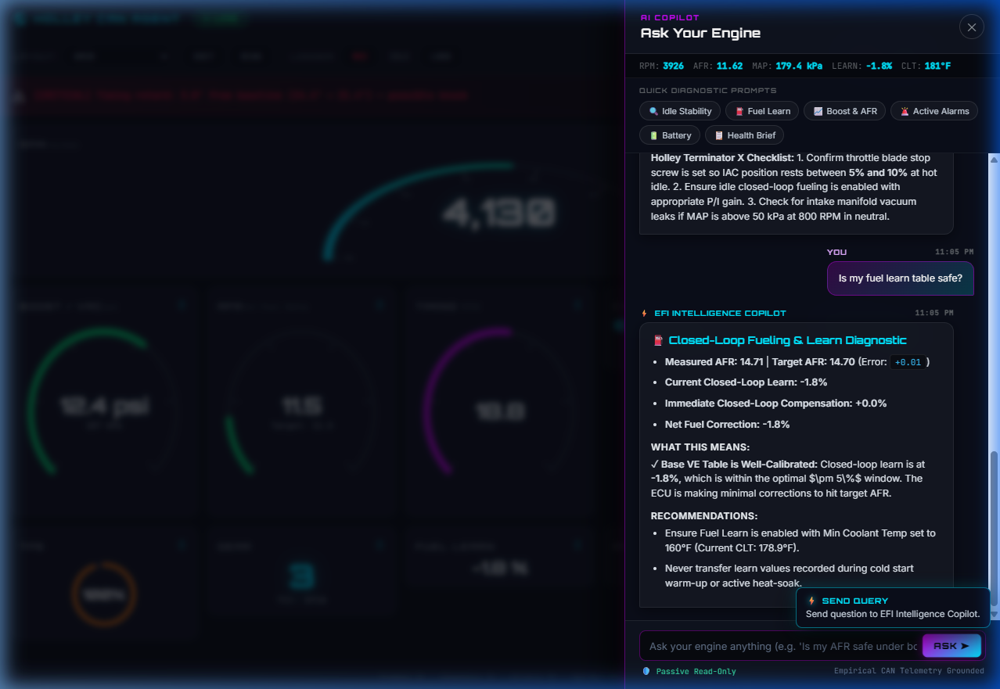

# EFI Intelligence Copilot for Holley Terminator X / X MAX

[](https://www.python.org/downloads/)
[](https://opensource.org/licenses/MIT)
[]()
[]()
[]()

> **An intelligence and decision-support layer operating alongside Holley EFI systems.**  
> *Holley provides engine control and telemetry; EFI Intelligence Copilot explains what the data means, detects anomalies, establishes vehicle baselines, and recommends evidence-backed next steps.*

---

## 🎯 Product Philosophy & Architectural Invariants

EFI Intelligence Copilot is **NOT** a replacement for Holley EFI software. It is designed to work hand-in-hand with it:

1. **Strict Read-Only Bus Safety (Zero Calibration Writes in MVP)**:  
   The application operates strictly in passive listen-only mode. It will **never** transmit frames, modify calibration tables, or issue flash commands over CAN. Existing handhelds, dashes, and ECU calibrations are completely protected.
2. **Deterministic Analysis First, AI Second**:  
   Telemetry decoding, baseline modeling, event detection, and fault identification are 100% deterministic code. AI/LLMs are strictly isolated to natural-language explanation and reasoning tools.
3. **Offline-First for Dyno Cells & Race Tracks**:  
   Runs fully standalone on offline Windows tuning laptops with zero internet connectivity and zero requirement for Python or compilers.
4. **Verifiable Protocol Provenance**:  
   Every decoded CAN channel carries strict provenance metadata (`HOLLEY_SOURCE_VERIFIED`, `SOURCE_VERIFIED`, `LIVE_HARDWARE_VERIFIED`, `TEST_FIXTURE_VERIFIED`, or `INFERRED`).

---

## ⚡ Key Features

- 🏎️ **Standalone Portable Tuning Laptop App**: Single ZIP distribution with zero dependencies; extract and run via 1-click batch files.
- 🔌 **Hardware Preflight Bus Sniffer**: Tests cable continuity, bus termination ($60\,\Omega$), baud rate (1 Mbps), and decodes live Holley frames before making a run.
- 💡 **Interactive On-Hover HUD Tooltips**: Glowing cyberpunk popup cards on every button, status indicator, and drag handle explaining exact function and state.
- 🎛️ **Touchscreen Visual Cluster Designer**: Drag-and-drop tiles to rearrange, customize channels, and switch between Arc, Radial, Bar, Ring, and Track display styles.
- 💾 **50Hz CAN Telemetry Logger & CSV Exporter**: Record high-precision time-series runs to SQLite and export CSV logs for MegaLogViewer and Excel.
- 🔊 **Voice Alarms & High-Contrast Themes**: Spoken voice announcements for critical engine thresholds and one-click toggle between Day and Night pit modes.
- 📊 **Multidimensional Baseline Engine**: Bins engine operation (Cold Idle, Warm Idle, Cruise, Accel, WOT/Boost) and tracks non-parametric robust statistics (Median, IQR, 5th/95th percentiles).
- ⚡ **Deterministic Event Detector**: High-speed state machine tracking engine start/stop, WOT pulls, idle hunting, thermal heat soak, and voltage sags.
- 🩺 **Rule-Based Diagnostic Engine**: Detects high-load fueling deviations (lean VE drift), hunting idle AFR oscillations, sensor dropouts, and thermal overheat.
- 📄 **Offline Health Reports**: Automatically compiles styled HTML and Markdown intelligence reports with domain health scores (Fueling, Idle, Sensors, Thermal, Electrical).
- 🌐 **Real-Time Web Dashboard**: SVG/Canvas circular gauges, live WebSocket telemetry push (20–50 Hz), and real-time alert banners.
- 🎮 **10-Scenario Virtual Simulator**: In-memory ECU telemetry generator for testing cold starts, WOT pulls, sensor failures, and heat soak indoors.

---

## ⚠️ Holley 4-Pin CAN Harness Wiring & Safety

The Holley Terminator X and Terminator X MAX expose a 4-pin Delphi/Aptiv Metri-Pack 150 female connector on the main harness:

```
           ┌──────────────┐
     Top   │ [A]      [B] │
     Latch │              │
           │ [C]      [D] │
           └──────────────┘
```

| Pin | Wire Color (Typical) | Function | Adapter Connection | Critical Safety Warning |
|:---:|:---------------------|:---------|:-------------------|:------------------------|
| **A** | **Blue** (or Blue/White) | **CAN High** | **CAN-H** | Differential signal positive |
| **B** | **White** (or White/Black) | **CAN Low** | **CAN-L** | Differential signal negative |
| **C** | **Red/White** (or Red) | **+12V Switched** | ⛔ **DO NOT CONNECT** | **NEVER connect Pin C to your USB adapter! +12V will destroy the adapter and damage your laptop.** |
| **D** | **Black** (or Black/White) | **Ground / Shield** | **GND** | Signal common ground reference |

### The 60Ω Termination Rule
A healthy CAN 2.0B bus requires two $120\,\Omega$ termination resistors in parallel ($60\,\Omega$ net resistance):
1. **Turn vehicle power OFF.**
2. Measure resistance across **Pin A (CAN-H)** and **Pin B (CAN-L)** using a digital multimeter:
   - **$55\,\Omega$ – $65\,\Omega$:** Perfect termination.
   - **$110\,\Omega$ – $130\,\Omega$:** Missing one terminator. Enable the $120\,\Omega$ jumper on your USB-CAN adapter.
   - **Open / Megaohms:** Missing both terminators or wiring fractured.

---

## 💻 Portable Tuning Laptop Distribution

For tuning laptops running Windows 10/11 without Python installed:

1. Download or copy [`dist/efi-intelligence-copilot-portable.zip`](file:///c:/Users/wugrut/.antigravity-ide/gemini-superpowers-antigravity/holley-can-agent/dist/efi-intelligence-copilot-portable.zip) (25.9 MB) onto a USB drive.
2. Extract the ZIP onto your laptop (e.g., `C:\EFI-Copilot`).
3. Use the included one-click batch launchers:

| Launcher Script | Purpose |
|:---|:---|
| `1_RUN_SIMULATOR_DEMO.bat` | Tests the app indoors without connecting to the car (generates sample report). |
| `2_RUN_LIVE_HOLLEY_USB.bat` | ⭐ **PREFERRED:** Connects natively to official Holley USB-to-CAN Cable (Part 558-443) via WinUSB at 1 Mbps. |
| `2_RUN_LIVE_HOLLEY_CABLE.bat` | Convenience alias for official Holley USB-CAN cable. |
| `2_RUN_LIVE_PCAN.bat` | (Optional Dev/Bench) Connects to PEAK PCAN-USB (`PCAN_USBBUS1`) in listen-only mode. |
| `3_RUN_LIVE_CANABLE_SLCAN.bat` | Prompts for Windows COM port and connects to CANable in SLCAN mode. |
| `4_PREFLIGHT_HARDWARE_CHECK.bat` | Sniffs the bus for 15s to verify $60\,\Omega$ termination and decode live Holley packets. |
| `5_RUN_WEB_DASHBOARD.bat` | Starts the local web server and opens the browser gauge cluster (`http://localhost:8420`). |
| `FIELD_GUIDE.md` | Complete printable offline field wiring and troubleshooting manual. |

---

## 🎛️ Live Dashboard Controls & Interactive HUD Tooltips

The live telemetry dashboard (`http://localhost:8420`) features interactive on-hover HUD cards for all buttons, toggles, and status indicators:



| Button / Control | Icon / State | Function & On-Hover Popup |
|:---|:---|:---|
| **AI Copilot** | `🤖 COPILOT` | Open the "Ask Your Engine" slide-over assistant to diagnose idle, fueling, boost, or active warnings. |
| **Layout Selector** | `LAYOUT: [GRID ▾]` | Switch between preset gauge configurations: **Grid**, **Track**, and custom user layouts. |
| **Edit Layout** | `EDIT` / `✓ DONE` | Enter touchscreen designer mode to drag-and-drop tiles, reorder gauges, or add new channels. |
| **Diagnostic View** | `DIAG` | Toggle high-density tabular view displaying all raw decoded CAN broadcast channels in real-time. |
| **Data Logger** | `REC` / `STOP` | Start or stop recording high-resolution 50Hz time-series data to SQLite with one click. |
| **Session Logs** | `LOGS` | Open the run history modal to view past logging runs and download CSV files for MegaLogViewer. |
| **Day / Night Theme** | `☀️` / `🌙` | Toggle between high-contrast daylight theme and dark pit mode. |
| **Voice Alarms** | `🔊` / `🔇` | Enable or mute synthesized spoken voice announcements for critical engine alarm thresholds. |
| **Alarm Banner** | `✕` | Dismiss active warning or critical engine alarm notifications. |
| **Drag Handle** | `⠿` | Grab to reorder and reposition gauge tiles across the cluster. |
| **Add Custom Gauge** | `+` | Add new tiles for Oil Pressure, Fuel Pressure, Boost, Target AFR, etc. |

---

## 🤖 "Ask Your Engine" — Live AI Decision Support Copilot

The AI Copilot brings expert EFI diagnostic reasoning directly into your web browser while the vehicle or simulator is running:



### Key Copilot Capabilities:
1. **Live Telemetry Context Bar**: Displays real-time `RPM`, `AFR`, `MAP`, `LEARN`, and `CLT` values at the top of the chat panel.
2. **1-Click Diagnostic Prompt Chips**:
   - 🔍 **Idle Stability**: Evaluates idle AFR error, timing advance swings, and IAC stepper motor position recommendations.
   - ⛽ **Fuel Learn & Trims**: Analyzes closed-loop learn percentage ($\pm 5\%$ safe window vs. base VE under-fueling).
   - 📈 **Boost & AFR Safety**: Assesses manifold pressure in PSI, power enrichment AFR targets, and boost timing retard margins.
   - 🚨 **Active Alarms**: Synthesizes active CAN bus safety alerts with root-cause troubleshooting advice.
   - 🔋 **Battery & Voltage**: Diagnoses alternator charging and voltage stability (>13.0V required for stable injector latency).
   - 📋 **Health Brief**: Produces an executive summary table of overall engine operating parameters.
3. **Conversational Natural Language Input**: Type custom questions (e.g. *"Is my fuel learn table safe?"* or *"Why is my timing retarding under boost?"*) and receive empirical, telemetry-grounded guidance with zero guesswork.
4. **Spoken Voice Output**: When Voice Alarms (`🔊`) are enabled, Copilot verbally summarizes the diagnosis.
5. **100% Offline Capability**: Runs locally on track/dyno laptops using deterministic EFI domain rules; optionally connects to LLMs (Gemini / Claude / OpenAI) when an API key is provided.

---

## 🛠️ Developer Setup & Local Execution

### 1. Requirements & Installation
- Python 3.10+ (tested on Python 3.12)
- PEAK PCAN-Basic driver (if using PCAN-USB on Windows) or SocketCAN (on Linux)

```bash
# Clone the repository
git clone https://github.com/wugrut/holley-can-agent.git
cd holley-can-agent

# Create and activate virtual environment
python -m venv .venv
.\.venv\Scripts\activate       # Windows
# source .venv/bin/activate    # Linux / macOS

# Install dependencies
pip install -r requirements.txt
```

### 2. Unified CLI Usage (`portable_entry.py`)

```bash
# 1. Run Preflight Bus Sniffer
python portable_entry.py preflight --interface pcan --channel PCAN_USBBUS1 --seconds 15

# 2. Run Live Logging & Analysis Session (Stop with Ctrl+C)
python portable_entry.py copilot --interface pcan --channel PCAN_USBBUS1 --duration 0

# 3. Run Offline Simulator Test
python portable_entry.py simulator --duration 15 --scenario wot_pull_lean_dev

# 4. Launch Live Real-Time Web Dashboard
python portable_entry.py dashboard --interface pcan --port 8420
```

### 3. Building the Standalone Portable Package

```bash
python build_portable.py
```
This compiles `efi_copilot.exe` using PyInstaller, bundles the web assets and field guides, and outputs `dist/efi-intelligence-copilot-portable.zip`.

---

## 🧪 Testing

The repository maintains 100% test coverage across protocol decoding, baseline math, diagnostics, and hardware adapters:

```bash
pytest -v
```
```
============================= 78 passed in 0.63s ==============================
```

---

## 📁 Repository Structure

```
holley-can-agent/
├── app/                          # Core analytical engine
│   ├── ai/                       # LLM reasoning & tool registry ("Ask Your Engine")
│   ├── baseline/                 # Multidimensional baseline engine (median, IQR)
│   ├── can/                      # Raw CAN frame abstractions
│   ├── diagnostics/              # Rule-based diagnostic engine & findings
│   ├── events/                   # Deterministic event state machines
│   ├── hardware/                 # PCAN, CANable, SocketCAN, and Virtual Simulator
│   ├── protocol/                 # HEFI 29-bit decoder & channel registry
│   ├── reports/                  # Health scores & Markdown/HTML report generators
│   ├── sessions/                 # Telemetry session metadata & buffering
│   ├── storage/                  # SQLite WAL time-series persistence
│   ├── telemetry/                # Signal quality, normalization, & validators
│   └── vehicle/                  # Vehicle profiles & modification chronology
├── docs/                         # Architecture & protocol documentation
│   ├── ARCHITECTURE.md           # End-to-end component dataflow
│   ├── CAN_PROTOCOL.md           # HEFI 29-bit protocol specification & provenance
│   ├── FIELD_GUIDE_TUNING_LAPTOP.md # Laptop field manual & wiring guide
│   ├── HARDWARE_SUPPORT.md       # Hardware adapter matrix & driver setups
│   ├── HARDWARE_VERIFICATION_PLAN.md # Live ECU testing protocol
│   ├── DIAGNOSTICS.md            # Rule-based diagnostic specifications
│   ├── PRODUCT.md                # Product philosophy, safety invariants, & personas
│   └── TELEMETRY_SCHEMA.md       # Signal definitions, units, & quality flags
├── holley_can/                   # Web dashboard & legacy API server
│   └── static/                   # HTML5/CSS3/JavaScript live gauge UI
├── launchers/                    # Windows 1-click batch launcher scripts
├── portable_entry.py             # Master CLI router for standalone execution
├── build_portable.py             # PyInstaller packaging automation script
├── config.yaml                   # Main configuration file
├── config.portable.yaml          # Tuning laptop pre-set configuration
├── requirements.txt              # Python package dependencies
└── tests/                        # 78 comprehensive pytest test fixtures
```

---

## 📄 License & Safety Disclaimer

Distributed under the MIT License.

**Automotive Safety Disclaimer**:  
*EFI Intelligence Copilot is an experimental decision-support analysis tool and does not provide active vehicle control. Always monitor engine vitals using approved gauges. Never operate a laptop while physically driving a vehicle on public roads; dyno tuning and street logging should always be performed with a dedicated passenger or in a controlled environment.*
